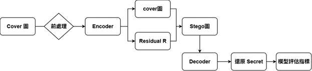
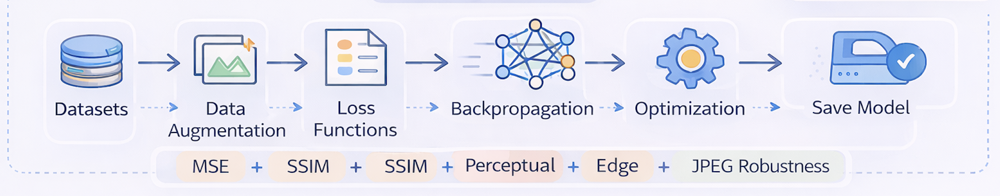

 
 
                                                                                               
用機器學習結合隱寫術，來改善浮水印問題
                                                                       
可以將LOGO/水印寫入圖片中來達到外觀不可視但可還原且驗證來源之作用  
                                                             
且針對現代需求有多做抗壓縮訓練來達到圖片經壓縮後仍能還原
